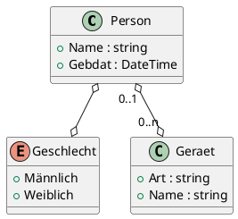

# Ein Person mit Geräten

```plantuml
@startuml

class Person {
   +Name : string
   +Gebdat : DateTime
}

enum Geschlecht {
    +Männlich
    +Weiblich
}

class Geraet {
    +Art : string
    +Name : string
}

Person o--o Geschlecht
Person "0..1" o--o "0..n" Geraet

@enduml
```
